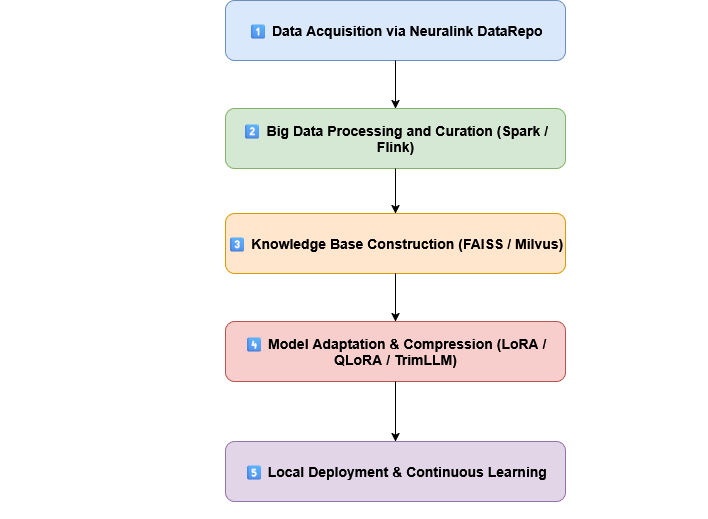

# datarepo_llm


## install hospital managment datasets

```python
source ven/bin/activate
python3 download_dataset.py
```

## URL for the dataset
```bash
/home/username/.cache/kagglehub/datasets/kanakbaghel/hospital-management-dataset/versions/1
```

## 1- Convert csv file to datarepo supported data type parquet
```bash
python3 csv_to_datarepo.py
```

## 2- BigData processing

```bash
python3 bigdata_processing.py

```
## 3- visualize the step
```bash
python3 visualize.py
```
## Create the hospital catalog
```bash
python3 hospital_catalog.py
```

## Initialization

```bash
./init.sh

```

## Navigate the datarepo

*you can navigate the datarepo using broswer by using the port 5000*
```bash
cd site_out
python3 -m http.server 5000
```


## Notes 




### Knowledge base Constructure
 It's creating new data that capture the words similarities by numbers and store it as database vector.Example
 ```bash
1) 
food_describe_fruit : red= 0.9 , round= 0.8 , sweet=0.7

apple = [0.9, 0.8, 0.7]
banana = [0.2, 0.9, 0.9]
2)
 “cat” → [0.2, 0.8, 0.1, …]
 “kitty” → [0.21, 0.79, 0.09, …]
```

## TODO
put all the data 